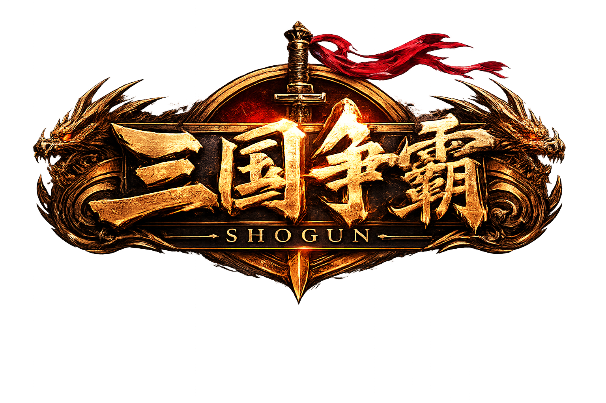

<div align="center">

# 三国争霸

<p align="center">
  
</p>

**以 Rust 驱动的三国策略游戏 · 基于 Bevy 与 egui 构建**

[](https://www.rust-lang.org/)
[](https://bevyengine.org/)
[](LICENSE)

</div>

---

## 游戏简介

《三国争霸》是一款回合制策略游戏，以中国古代三国时期为背景。玩家扮演一方诸侯，在历史地图上经营城池、招募武将、运筹帷幄，通过内政、外交与征伐逐鹿中原。

游戏完全由 Rust 构建，采用 **Bevy** 游戏引擎渲染，**egui** 提供即时制 UI，SQLite 驱动历史数据库，确保每一局游戏都建立在真实史料之上。

---

## 游戏特色

### 回合策略系统

- **月度指令制**：每回合（月）每座城池可执行一项内政指令，每名武将可执行一项行动
- **多线并行**：开发城池、招募人才、调遣军队、外交斡旋可在同一回合同时进行
- **战争与后勤**：军队调动需沿道路行进，战斗基于武将属性与兵力实时结算

### 历史数据驱动

- **SQLite 历史目录**：所有势力、武将、城池、剧本、历史事件均来自 SQLx 迁移文件
- **多剧本开局**：从黄巾之乱到三国鼎立，每个剧本均有独立的历史背景与初始格局
- **历史生命事件**：武将的生老病死、联姻结盟按历史脉络推进，增强代入感

### 智能 AI 对手

- **规则一致性**：AI 与玩家遵守完全相同的指令规则，不存在隐藏优势
- **策略多样性**：AI 根据势力实力、地理态势、外交关系做出开发、征战、结盟等决策

### 深度内政与科技

- **城池开发**：农业、商业、城防等多维度建设，设施类型影响资源产出
- **科技体系**：势力级科技树，解锁高级兵种与增益效果
- **人才网络**：武将拥有多维属性与专属标签，可任命太守、派遣任务

### 外交与联姻

- **势力外交**：同盟、敌对、劝降，外交关系动态演变
- **联姻系统**：通过婚姻结盟巩固势力关系
- **家族关系**：武将间的血缘与婚姻纽带影响忠诚度与势力稳定

### 存档与国际化

- **版本化存档**：存档向后兼容，支持多存档槽位管理
- **中英双语 UI**：基于 Fluent 的国际化系统，完整支持中文与英文界面
- **音频体验**：主菜单 BGM，支持分场景音量控制

---

## 技术架构

### 分层设计

```
┌─────────────────────────────────────────────┐
│                   core                      │
│   Bevy 引擎 · egui UI · 音频 · 国际化 · 输入  │
├─────────────────────────────────────────────┤
│                   game                      │
│   领域模型 · 指令规则 · 战斗 · 外交 · AI · 存档 │
└─────────────────────────────────────────────┘
```

项目采用严格的**双层架构**：

- **`game` 层（纯领域逻辑）**：零引擎依赖。包含 `GameState` 状态机、指令验证与月度结算、战斗系统、外交关系、武将生命周期、科技树、AI 决策、存档序列化以及历史剧本加载。所有规则在此层定义并强制执行。
- **`core` 层（引擎与交互）**：负责 Bevy 渲染、egui 界面、屏幕流转（主菜单 → 游戏内）、设置持久化、本地化及音频。`core` 仅通过 `game` 的公共 API 调用领域逻辑，不引入任何额外规则。

> `game` 对 Bevy 和 egui 完全无感知。这一边界确保领域逻辑可独立测试，且 UI 变更不影响游戏规则。

### 核心技术栈

| 组件       | 技术选型                                        |
| ---------- | ----------------------------------------------- |
| 游戏引擎   | [Bevy 0.18](https://bevyengine.org/)            |
| UI 框架    | [bevy_egui](https://github.com/mvlabat/bevy_egui) + egui |
| 历史数据库 | SQLite（via [SQLx](https://github.com/launchbadge/sqlx)） |
| 序列化     | serde + serde_json                              |
| 国际化     | [i18n-embed](https://crates.io/crates/i18n-embed)（Fluent） |
| 音频       | [rodio](https://crates.io/crates/rodio)         |
| 跨平台打包 | macOS `.app` · Linux tarball · Windows zip      |

### 关键设计原则

- **枚举驱动的状态**：`CommandKind`、`GameStatus`、`Controller` 等核心类型均为枚举，在 UI 边界才转换为显示文本
- **确定性数据结构**：使用 `BTreeMap` / `BTreeSet` 保证 UI 展示、存档文件与测试断言的排序一致性
- **零信任输入**：玩家输入、文件数据、数据库内容均经显式验证，生产路径不使用 `unwrap()`
- **月度结算顺序**：验证/执行指令 → 结算收入 → 清除待处理指令 → 刷新状态 → 推进时间 → 触发历史事件

---

## 快速开始

### 环境要求

- Rust 1.85+（edition 2024）
- SQLite 3

### 运行与开发

```sh
# 启动游戏
cargo run

# 重建本地历史数据库
cargo run --bin build_history_db

# 编译检查
cargo check

# 运行全部测试
cargo test

# 运行特定测试套件
cargo test --test gameplay
cargo test --test history_db
cargo test --test map_boundaries

# Lint 检查
cargo clippy --all-targets -- -D warnings

# 格式化代码
cargo fmt
```

### 目录结构

```
src/
  main.rs          # 二进制入口
  lib.rs           # 库表面（供集成测试与辅助二进制使用）
  core/            # Bevy 应用、egui UI、音频、国际化、设置、输入
  game/            # 领域模型、规则、AI、指令、存档、历史数据
  bin/             # 辅助二进制（build_history_db、import_three_kingdoms）
assets/
  data/            # SQLite schema、种子数据、迁移
  fonts/           # 内嵌字体（CJK 支持）
  audio/           # 音频资源
  icons/           # 应用图标
tests/             # 集成测试（gameplay、history_db、map_boundaries）
locales/           # i18n Fluent 翻译文件（en-US、zh-CN）
migrations/        # SQLite 迁移源文件
packaging/         # 跨平台打包（macOS、Linux、Windows）
```

---

## 跨平台打包

```sh
make package-macos    # dist/Shogun-0.1.0-macos.zip
make package-linux    # dist/shogun-0.1.0-linux.tar.gz
make package-windows  # dist/shogun-0.1.0-windows.zip
make package          # 全部平台
```

---

## 许可证

本项目基于 [MIT 许可证](LICENSE) 开源。
